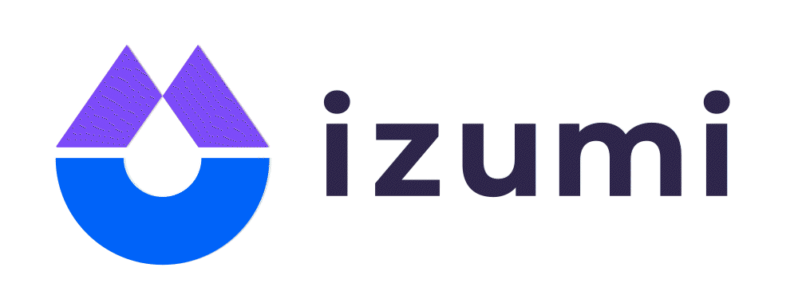

# Izumi-contracts-UniswapV3Mining

<div align="center">
  <a href="https://izumi.finance"> 
    
  </a>
</div>

Contracts for liquidity mining with UniswapV3 NFTs.

# Designs:

- Mining Type:

  - Model1: mining with fixed price range:
    - Liquidity in a fixed range (e.g. `[-10,10]` ticks in `USDC/USDT/0.01@Ethereum` pool) shares the incentives.

  - Model2: mining with impermanent loss protection.
    - two types of tokens. `uniToken` will be added to the UniswapV3 pool and `lockToken` will be locked in the contract.

  - Model3: mining with dynamic range.
    - liquidity will be added based on the instantaneous price.

- Boosting Mechanism:

  - iZi tokens.

  - veiZi NFT.

# Scripts:
Each script runs some specific tasks. Run a script with the following command line. 

Find more at [Guide for Hardhat Scripts](https://hardhat.org/guides/scripts.html').

```shell
$ HARDHAT_NETWORK='CUSTOM_NETWORK' node scripts/THE_SCRIPTS.js argv[0] argv[1] ...
```

If no argvs are passed, run the follows alternatively.
```shell
$ npx hardhat run scripts/THE_SCRIPTS.js --network CUSTOM_NETWORK
```

For testing, 
```shell
$ npx hardhat test FILE_TO_TEST|EMPTY_FOR_ALL
```
